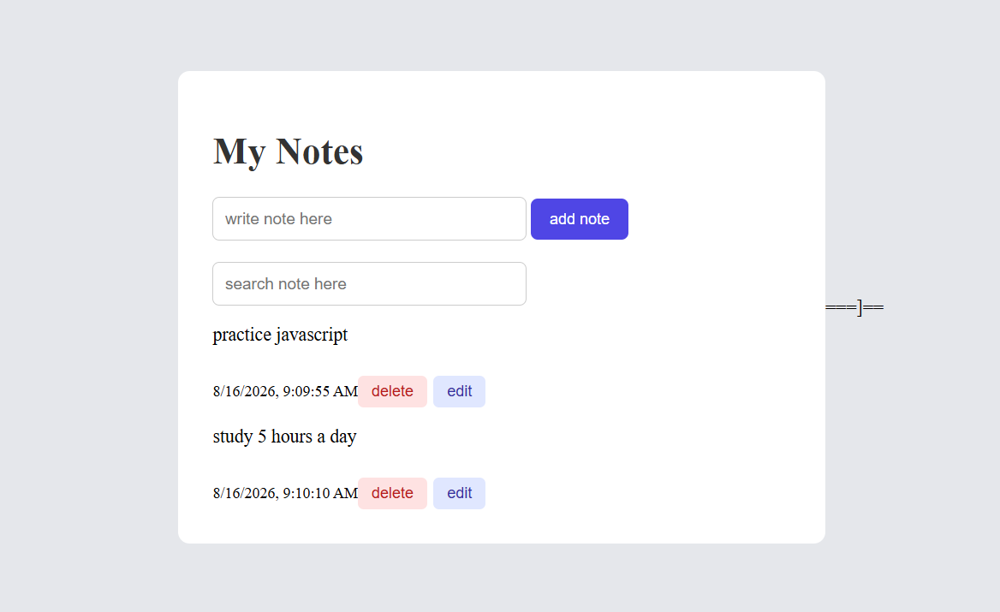
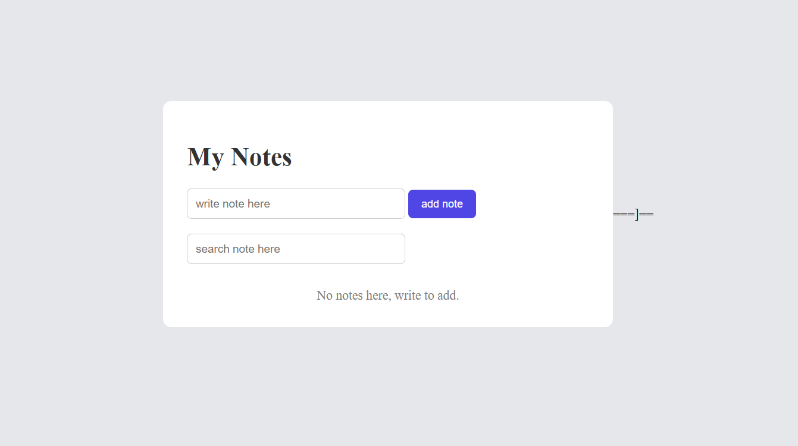

# 📝 Notes App

A fast, persistent note-taking app built with vanilla JavaScript — no frameworks, no libraries, just core fundamentals done right.

🔗 *Live Demo:* [your-deployment-link-here]



## ✨ Features

- *Full CRUD* — Create, Read, Update, and Delete notes
- *Persistent storage* — notes are saved to localStorage, so nothing is lost on refresh or browser close
- *Dynamic rendering* — the entire UI re-renders from a single state object on every change, keeping the app predictable
- *Event delegation* — one listener on the parent container handles all note interactions instead of attaching listeners to every individual element
- *Safe DOM construction* — elements are built with createElement instead of innerHTML, avoiding injection risks and giving full control over structure

## 🛠️ Tech Stack

- HTML5
- CSS3
- Vanilla JavaScript (ES6+)

## 🏗️ Architecture

The app is built around one core principle: *state should drive the UI, not the other way around.*


User Action → Update State → Save to localStorage → Re-render UI


- A single notes array acts as the source of truth
- Every action (add, edit, delete) updates that array first
- The updated array is saved to localStorage
- The UI is then re-rendered completely from the current state

This avoids manual DOM patching and eliminates bugs where the UI and data get out of sync — a mistake that's easy to make without this pattern.

## 📂 Project Structure

```
notes-app/
├── index.html
├── style.css
├── script.js
└── README.md
```

## 🧠 Key Concepts Practiced

- *Event delegation* — attaching one listener to a parent container and identifying the target via event.target, instead of looping through elements to attach individual listeners
- *createElement vs innerHTML* — building DOM nodes programmatically for safer, more maintainable rendering
- *State management fundamentals* — a single source of truth pattern, the same principle frameworks like React are built on
- *localStorage API* — getItem/setItem with JSON.stringify/JSON.parse to persist non-string data

## 🚧 Challenges & Solutions

- *Problem:* Notes would sometimes duplicate or fail to update correctly when edited.
  *Solution:* Traced it back to mutating the state array directly instead of creating a new array — switched to immutable update patterns.

- *Problem:* Attaching listeners to every note button caused issues when notes were deleted/re-rendered.
  *Solution:* Refactored to event delegation on the parent container, so listeners persist regardless of how many times the list re-renders.

## 🚀 Getting Started

1. Clone the repo
   bash
   git clone https://github.com/your-username/notes-app.git
   
2. Open index.html in your browser — no build step, no dependencies

## 📌 Future Improvements

- Search/filter notes
- Note categories or tags
- Refactor into a class-based (OOP) architecture

---
Author:
Sana Atta
Built as part of my self-paced JavaScript learning journey.
